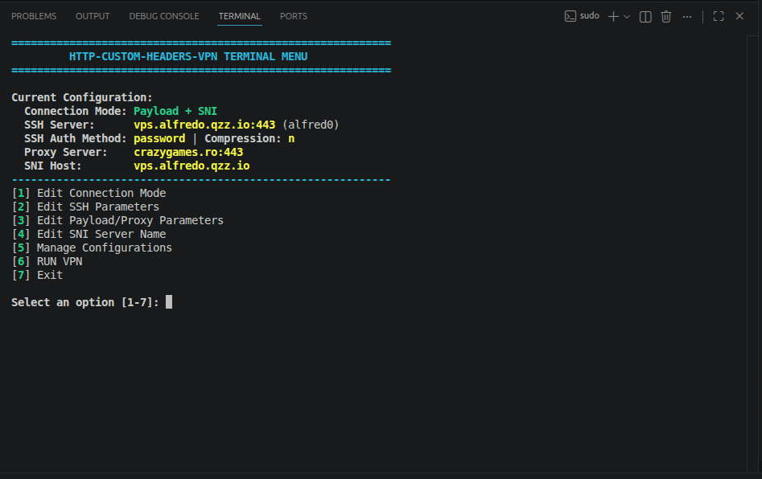
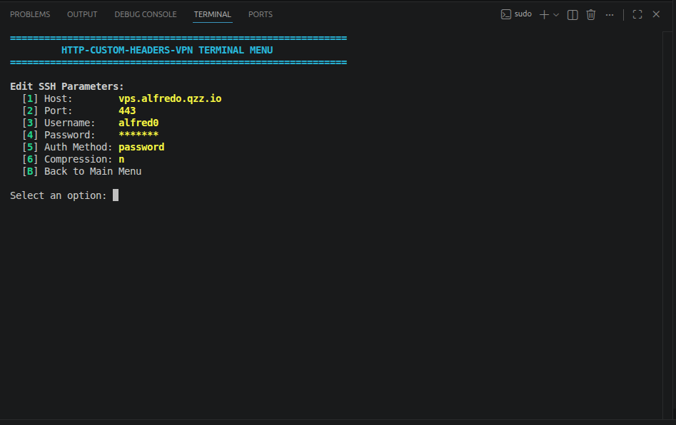
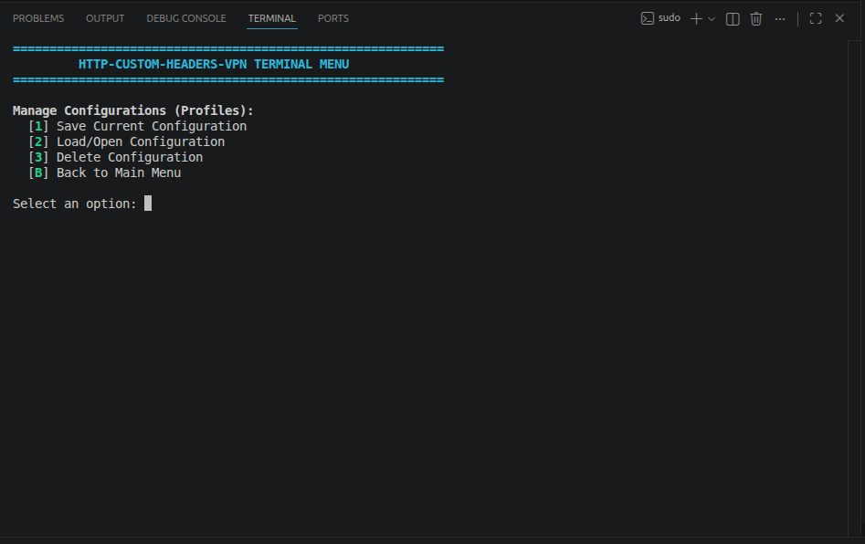

[English](README.md) | [Français](README.fr.md) | [Español](README.es.md) | [العربية](README.ar.md) | [Português](README.pt.md) | [中文](README.zh.md)

# OmniTunnel CLI (v1.1.6)

[](LICENSE)
[](#installation)

**OmniTunnel CLI** is a command-line VPN client based on SSH tunnels, V2Ray/Xray protocols, and HTTP payload injection, designed to bypass network restrictions under **Linux (Ubuntu/Debian)** and **Android (Termux)**.

- **V2Ray / Xray / Sing-Box**: import share links (`vless://`, `vmess://`, `trojan://`, `ss://`, `hy2://`).
- **Sing-Box TUN Engine**: `tun0` with DoH caching.
- **Encrypted `.ot` profiles**: export/import with PBKDF2 password protection.
- **Kernel TCP BBR** optimization.

— [Changelog](docs/CHANGELOG.md)

---

### Installation (Debian / Ubuntu)

```bash
# 1. Sing-Box engine (if not installed)
cd /tmp && wget https://github.com/SagerNet/sing-box/releases/download/v1.14.0/sing-box_1.14.0_linux_amd64.deb && sudo apt install -y ./sing-box_1.14.0_linux_amd64.deb

# 2. OmniTunnel CLI
cd /tmp && wget https://github.com/RadouaneElarfaoui/omnitunnel-cli/releases/download/v1.1.6/omnitunnel-cli_1.1.6.deb && sudo apt install -y ./omnitunnel-cli_1.1.6.deb

# 3. Manual install (alternative)
sudo apt update
sudo apt install -y git openssh-client sshpass netcat-openbsd python3 python3-certifi iptables
git clone https://github.com/RadouaneElarfaoui/omnitunnel-cli.git
cd omnitunnel-cli
chmod +x menu.py runvpn.sh install.sh uninstall.sh
```

---

## 🖥 Usage

If installed via the one-line installer, simply run:

```bash
otunnel
```

*(or `sudo otunnel`)*

Or from within the cloned repository folder:

```bash
chmod +x menu.py runvpn.sh
./menu.py
```

The interactive menu lets you edit SSH/payload/SNI settings, manage `.ot` profiles, view logs, and launch the VPN. To stop, press `Ctrl+C`.

 |  | 

### Sharing Profiles (.ot)
Export/import `.ot` profile files to share configs with others:

```bash
# Export active config to .ot
python3 src/omni_profile.py export -i cfgs/settings.ini -o MyProfile.ot --name "MyServer" --password "secret"

# Import .ot file to settings.ini
python3 src/omni_profile.py import -i MyProfile.ot -o cfgs/settings.ini --password "secret"
```

---

## ⚙️ Manual Configuration (Headless)

Edit [cfgs/settings.ini](cfgs/settings.ini) directly instead of using the menu, then launch:

```bash
sudo ./runvpn.sh
```

Connection modes (`connection_mode`):
* `0` — **Direct SSH**: raw SSH tunnel.
* `1` — **Payload Only**: HTTP header injection via proxy.
* `2` — **SNI Only**: SSL/TLS SNI spoofing.
* `3` — **Payload + SNI**: maximum masking.

---

## Building RedSocks & Dns2Socks (optional)

Only needed if the prebuilt tools aren't found. `make` and `libevent-dev` are required to compile the bundled sources; otherwise they're not part of a normal install:

```bash
sudo apt install -y make libevent-dev build-essential
```

---

## 📄 License
This project is distributed under the permissive **Apache-2.0** license.
