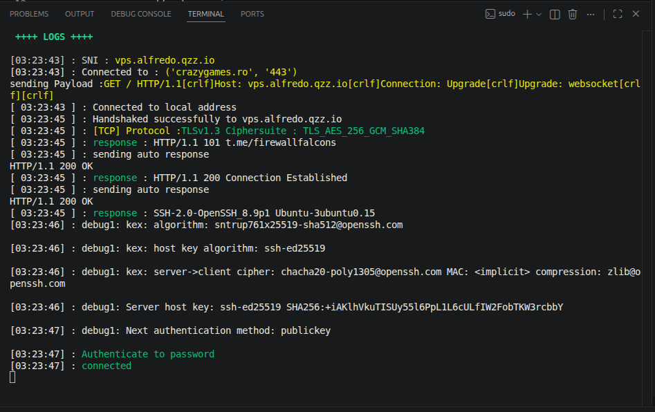

[English](README.md) | [Français](README.fr.md) | [Español](README.es.md) | [العربية](README.ar.md) | [Português](README.pt.md) | [中文](README.zh.md)

# OmniTunnel CLI (v1.1.0)

[](LICENSE)
[](#环境要求与安装)

**OmniTunnel CLI** 是一款基于强健 SSH 隧道的命令行 VPN 客户端，旨在绕过网络限制并优化 **Linux (Ubuntu/Debian)** 和 **Android (Termux)** 下的连接安全性。

---

## 🚀 v1.0.2 版本新特性

*   **Python 交互式菜单 (`menu.py`)**：一个现代化的命令行界面 (CLI)，用于无缝编辑和管理您的配置文件、载荷 (payloads) 和 SSH 凭据，而无需手动修改原始的 ini 文件。
*   **增强的 SSH 兼容性**：显式支持现代加密套件和密钥交换算法 (`+ssh-rsa`, `ssh-ed25519`, `ecdsa`, `rsa-sha2`)，解决了在较新 Linux 发行版（如 Ubuntu 22.04+、Debian 12+）上的连接受阻问题。
*   **安全关闭与信号管理**：在启动脚本中集成了系统 `trap` 处理器，以便在发生中断 (`Ctrl+C`) 时，干净利落地清理并终止所有子进程 (`redsocks`, `dns2socks`, `ssh`)。
*   **强健的隔离编译**：更新了 `runvpn.sh` 脚本，以便在运行中动态编译缺失的依赖项，并将其安全地隔离在 `./bin` 目录中，避免污染系统的全局目录树。
*   **提高网络弹性**：先进的监听循环管理和对远程服务器关闭套接字 (sockets) 的高效检测，可防止崩溃和文件描述符泄漏。

---

## 🛠 环境要求与安装

### ⚡ 一键安装（推荐）

```bash
curl -fsSL https://raw.githubusercontent.com/RadouaneElarfaoui/omnitunnel-cli/main/install.sh | sudo bash
```

或使用 `wget`：

```bash
wget -qO- https://raw.githubusercontent.com/RadouaneElarfaoui/omnitunnel-cli/main/install.sh | sudo bash
```

> **注意**：安装程序会自动检测已安装的组件与 Sing-Box，仅下载缺失的内容。

### 🗑️ 一键卸载

```bash
curl -fsSL https://raw.githubusercontent.com/RadouaneElarfaoui/omnitunnel-cli/main/uninstall.sh | sudo bash
```

---

### 手动安装（Debian / Ubuntu / Mint）

```bash
# 1. 安装系统依赖
sudo apt update
sudo apt install -y git openssh-client sshpass netcat-openbsd corkscrew screen python3 python3-certifi make libevent-dev
sudo apt install -y git openssh-client sshpass netcat-openbsd python3 python3-certifi iptables

# 2. Sing-Box 核心（若未安装）
cd /tmp && wget https://github.com/SagerNet/sing-box/releases/download/v1.14.0/sing-box_1.14.0_linux_amd64.deb && sudo apt install -y ./sing-box_1.14.0_linux_amd64.deb

# 3. 克隆与授权
git clone https://github.com/RadouaneElarfaoui/omnitunnel-cli.git
cd omnitunnel-cli
chmod +x menu.py runvpn.sh install.sh uninstall.sh
```

---

## 🖥 使用方法（推荐方法 - CLI 菜单模式）

如果通过一键安装脚本安装，直接在任意终端运行：

```bash
otunnel
```

*(或 `sudo otunnel`)*

若从项目源码目录运行：

```bash
chmod +x menu.py runvpn.sh
./menu.py
```

### 配置文件编辑与管理
就像 Android 上的 HTTP Custom 应用一样，您可以高精度地配置您的隧道和配置文件：

| 主菜单 | SSH 参数设置 |
| :---: | :---: |
|  |  |

| 配置文件管理（保存/加载） |
| :---: |
|  |

---

## ⚙️ 手动配置（高级 / 无头模式）

如果您更喜欢在不使用交互式界面的情况下手动配置 VPN，请编辑 [cfgs/saved/active.ot](cfgs/saved/active.ot) 文件：

### 支持的连接模式 (`connection_mode`)：
*   `mode 0`：**Direct SSH** — 无中介的原始 SSH 隧道。
*   `mode 1`：**Payload Only** — 通过代理注入自定义 HTTP 头部。
*   `mode 2`：**SNI Only** — 通过伪装 SSL/TLS SNI (Server Name Indication) 绕过深度 packet 检测 (DPI)。
*   `mode 3`：**Payload + SNI** — 最高级别的伪装（HTTP 载荷穿过透明的 SSL 隧道）。

应用配置后，直接启动后台代理：
```bash
sudo ./runvpn.sh
```

---

## 📊 诊断与连接日志

一旦连接，流量传输随即建立，事件将实时显示在您的控制台中：



> **停止 VPN**：要干净地关闭所有网络隧道并恢复操作系统的默认路由表，只需使用组合键 `Ctrl + C` 即可。

---

## 📄 许可证
该项目采用宽松的 **Apache-2.0** 许可证进行分发。
